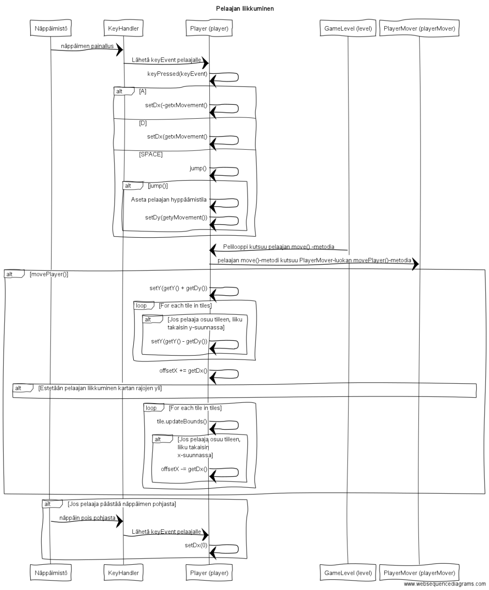

### Aiheen kuvaus ja rakenne
**Aihe:** Projektin aiheena on Super Mario Bros -tyylinen tasohyppelypeli.
Pelissä tulee olemaan yksi taso, joka sisältää hirviöitä ja kerättäviä kolikoita.
Pelaaja saa pisteitä kerätessään kolikoita sekä menettää "healthia" jos hän epäonnistuu väistämään monstereita.
Lisäksi tason suoritusaika, kerätyt kolikot sekä tuhotut hirviöt (Hirviöt pystyy tuhoamaan hyppäämällä niiden päälle)
vaikuttavat loppupisteytykseen. Kun käyttäjä on suorittanut tason, peli loppuu. Pelin loputtua pelaajan loppupisteet näytetään näytöllä.
	Pelissä on myös tarkoitus olla tekstuureja sekä tekstuureista koostuvia animaatioita (esim. kolikon pyörittäminen ja pelaajan kävely). Näitä varten tarvitaan konfiguraatiotiedostoja sekä
jollain kuvankäsittelyohjelmalla piirrettyjä kuvia. Tekstuurien ja animaatioiden suunnittelussa käytetään Pyxel Edit -ohjelmistoa.
	Liikkumiseen pelissä käytetään A- ja D -näppäintä sekä välilyöntiä, jolla pelaaja hyppää.

**Käyttäjät:** Peliä käyttää vain yksi käyttäjä ja lisäksi pelissä on tietokoneohjattuja hirviöitä.

### Kaikkien käyttäjien toiminnot & käyttötapaukset
* Liikkuminen (eteen, taakse, hyppy)
* Kolikoiden kerääminen
* Hirviöiden tappaminen

### Luokkakaavio

### Sekvenssikaaviot

## Pelin alustus ja peliloopin toiminta

Kaavio näyttää, miten pelin käynnistyminen tapahtuu ja mitä pelilooppi tekee pelin pyöriessä.

## Pelaajan liikkuminen

Kaavio sisältää pelaajan liikkumisen alkaen näppäimen painalluksesta peliloopin käsittelemään liikkumistoiminnallisuuteen.
Myös näppäimen päästäminen pohjasta on mallinnettu.